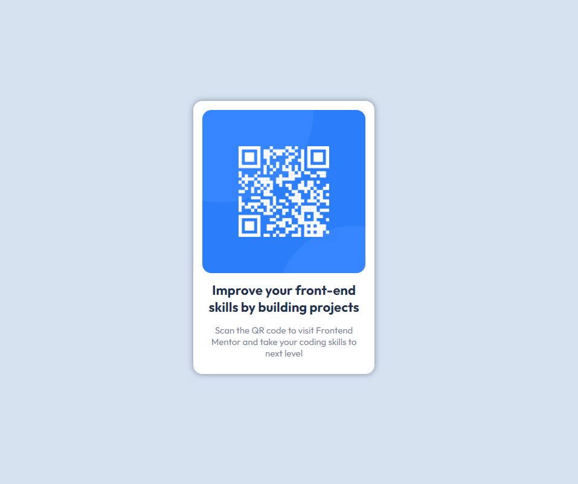

## Table of contents

- [Overview](#overview)
  - [Screenshot](#screenshot)
  - [Links](#links)
- [My process](#my-process)
  - [Built with](#built-with)
  - [What I learned](#what-i-learned)
- [Author](#author)

**Note: Delete this note and update the table of contents based on what sections you keep.**

## Overview

This is a simple QR code component that can be used on any website. It is made using HTML & CSS.

### Screenshot

### Links

- Live Site URL: (https://qrfr.netlify.app/)

## My process

### Built with

- Semantic HTML5 markup
- CSS custom properties
- Flexbox

### What I learned

I learned that CSS can be used to control the layout, fonts, colors, and other visual aspects of a web page. I also learned that CSS can be used to create effects such as shadows and rounded corners.

## Author

- Devashish jadhav
- Frontend Mentor - [@ddevilz](https://www.frontendmentor.io/profile/@ddevilz)
- Twitter - [@dev_j7](https://www.twitter.com/@dev_j7)

**Note: Delete this note and add/remove/edit lines above based on what links you'd like to share.**

